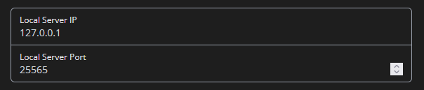

---

:::caution

To reload your changed config in-game, use the command `/lreload`

:::

## Essential

### API Key

Necessary for most of Lilith's core features. Only valid API keys are accepted, meaning you are required to copy and paste the full API key.

:::tip

Your API key is configured automatically when you do `/api new` in-game while on Lilith.

:::

## Bypasses

Gives you fine control over which bypasses Lilith uses.

- Lunar Only
  - Lunar (freelook, autotext)
  - Lunar Cheats (xray)
  - Lunar Hitreg (1.7 hitreg)
- Badlion (minimap)
- Forge (hide modlist)

You may have to rejoin after doing `/lreload` in order to reload some of these bypasses.

## Proxy Options

### Log Chat Messages

Allows you to dump all chat messages into Lilith's terminal output.

### Local Server

Allows you to configure the host and port on which Lilith's proxy listens. This is a technical feature, so if you don't know what you're doing, don't touch it. Does not reload on `/lreload`

