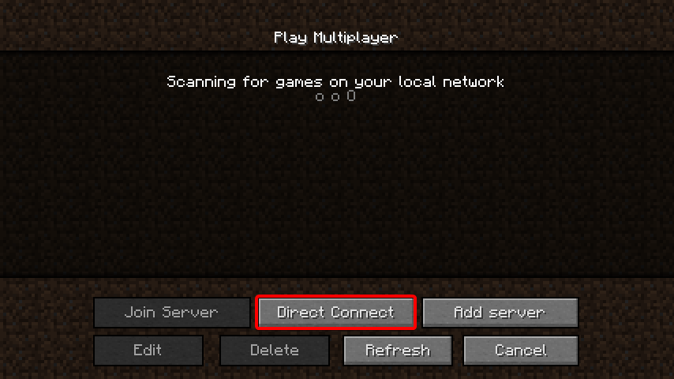
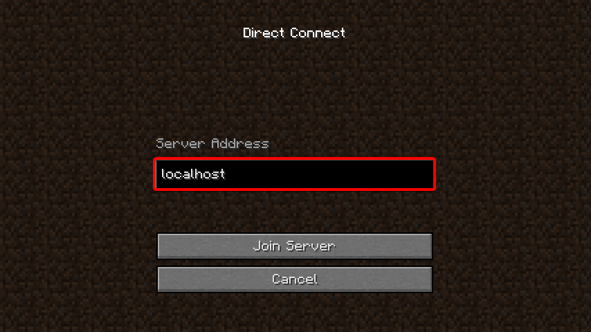

---

## Downloading

import Tabs from '@theme/Tabs';
import TabItem from '@theme/TabItem';

<Tabs>
  <TabItem value="windows" label="Windows" default>
      
Download the latest launcher version for Windows from the <a href="/downloads">downloads page</a>. Double click the executable to start Lilith.

  </TabItem>
  <TabItem value="macos" label="MacOS">
      

          Download the latest launcher.command for MacOS from the <a href="/downloads">downloads page</a>.
          Once it is in your Downloads folder, open Terminal and type `chmod +x ~/Downloads/launcher.command` (pressing enter afterwards).
          Now you will be able to run Lilith by double clicking on the launcher.command file in Finder.
      

  </TabItem>
  <TabItem value="linux" label="Linux">
        

            Lilith for Linux is currently only available as a terminal application. However, it's quite simple to install and run. These instructions apply to
            most Linux distributions as well as MacOS, if you do not wish to use a dmg file.   
            To get started, download the latest launcher version for Linux (or MacOS) from the <a href="/downloads">downloads page</a>.
            You can do this manually or right click on the button and copy the link for use with <code>wget</code>. Once you have downloaded the file,
            open a terminal to the enclosing folder and run <code>chmod +x ./lilith-launcher-linux-s2</code> (or <code>chmod +x ./lilith-launcher-macos-s2</code>). You are now able to launch Lilith with
            <code>./lilith-launcher-linux-s2</code> (or <code>./lilith-launcher-macos-s2</code>)
        

  </TabItem>
</Tabs>

:::tip

Unlike older versions of Lilith, the launcher is not required to be run in its own folder.
Additionally, since you are downloading a launcher, it will automaticlaly update Lilith to the latest version,
so you only need to download Lilith once!

:::

## Authorizing

Follow the instructions in the displayed terminal to authorize your discord account and get started using Lilith. For help with this step, please ask in #support.

## Connecting

To use Lilith, you'll need to connect to the Lilith server instead of the Hypixel server.

:::warning

This requires Lilith always be running when you're playing.

:::

First, click on `Direct Connect`:

:::note Direct Connect

:::

Then, type `localhost` into the text box just as below:

:::note Server Address

:::

Finally, click the `Join Server` as above.